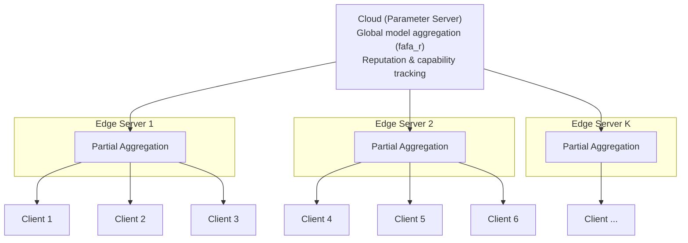

<!--
@PATH: fl_system/README.md
@DATE: 03.18.2026
@AUTHOR: Howard
@E-MAIL: QSX20251439@student.fjnu.edu.cn

fl_system framework. fafa_r algorithm, architecture, configuration, experiments.
-->

# FAFA-R: Fast Adaptive Federated Aggregation with Reputation

A three-tier hierarchical federated learning system for improved convergence under system heterogeneity and non-IID data.

---

## Overview


| Aspect             | Description                                                     |
| ------------------ | --------------------------------------------------------------- |
| **Architecture**   | Client → Edge Server → Cloud (Parameter Server)                 |
| **Core Algorithm** | FAFA-R (Fast Adaptive Federated Aggregation with Reputation)    |
| **Objective**      | Improve convergence under system heterogeneity and non-IID data |
| **Datasets**       | CIFAR-10, CIFAR-100, FEMNIST                                    |
| **Baselines**      | FedAvg, Hierarchical FedAvg, FedProx, SCAFFOLD                  |


---

## Key Idea

FAFA-R combines gradient similarity, reputation, and system capability to compute adaptive aggregation weights.

**1. Similarity** (gradient deviation from previous global model):

$$s_i = \exp\left(-\gamma g_i - \bar{g}_{\text{prev}}^2\right)$$

**2. Reputation update** (exponential moving average):

$$r_i^{(t)} = \lambda \cdot r_i^{(t-1)} + (1 - \lambda) \cdot s_i$$

**3. System capability** (relative compute speed):

$$\kappa_i = \frac{1}{1 + \tau_i / \bar{\tau}}$$

**4. Aggregation weight**:

$$\beta_i \propto r_i \cdot \kappa_i$$

where g_i is client i's gradient, \bar{g}_{\text{prev}} is the previous global gradient, \tau_i is client i's round latency, and \bar{\tau} is the average latency.

---

## Architecture



---

## Directory Structure

```
fl_system/
├── main.py                 # Entry point
├── config/                 # Experiment & algorithm configs
├── data/                   # Data loaders & client partitioning
├── models/                 # Model definitions (CNN, ResNet, etc.)
├── client/                 # Client-side training logic
├── edge/                   # Edge server aggregation
├── server/                 # Cloud parameter server
├── aggregation/            # FAFA-R, FedAvg, FedProx, etc.
├── utils/                  # Logging, metrics, helpers
├── security/               # Secure aggregation (optional)
└── privacy/                # Differential privacy (optional)

scripts/                    # External data preparation
├── prepare_cifar.py        # Download CIFAR-10/100
├── partition_cifar.py      # Dirichlet Non-IID partitioning
└── prepare_femnist.py      # FEMNIST via LEAF
```

---

## Training Workflow

1. **Data preparation**: Run `scripts/prepare_cifar.py`, `scripts/partition_cifar.py`, `scripts/prepare_femnist.py` (or `./run.sh`).
2. **Configuration**: Set `config/experiment.yaml` (dataset, algorithm, clients, rounds, etc.).
3. **Launch**: `python fl_system/main.py --config config/experiment.yaml`.
4. **Client phase**: Each client trains locally; gradients/models are sent to the edge.
5. **Edge phase**: Edge servers perform partial aggregation over their clients.
6. **Cloud phase**: Parameter server runs FAFA-R (or baseline) aggregation; broadcasts updated model.
7. **Repeat** until convergence or max rounds.

---

## Supported Algorithms


| Algorithm               | Description                                                   |
| ----------------------- | ------------------------------------------------------------- |
| **FAFA-R**              | Proposed: reputation + system capability weighted aggregation |
| **FedAvg**              | Standard federated averaging                                  |
| **Hierarchical FedAvg** | Two-level FedAvg (client→edge→cloud)                          |
| **FedProx**             | FedAvg with proximal term for heterogeneity                   |
| **SCAFFOLD**            | Variance reduction via control variates                       |


---

## Configuration

```python
# config/experiment.yaml (example)

algorithm: fafa_r  # fafa_r | fedavg | hierarchical_fedavg | fedprox | scaffold

data:
  dataset: cifar10          # cifar10 | cifar100 | femnist
  partition: dirichlet
  alpha: 0.1
  num_clients: 100

hierarchy:
  num_edges: 10
  clients_per_edge: 10

training:
  rounds: 200
  local_epochs: 5
  batch_size: 32
  lr: 0.01

fafa_r:
  gamma: 0.1      # similarity sensitivity
  lambda: 0.9      # reputation smoothing
```

---

## Data Pipeline


| Step            | Script                       | Output                                               |
| --------------- | ---------------------------- | ---------------------------------------------------- |
| Download CIFAR  | `scripts/prepare_cifar.py`   | `data/raw/cifar-10-batches-py/`, `cifar-100-python/` |
| Partition CIFAR | `scripts/partition_cifar.py` | `data/processed/cifar{10,100}_dirichlet/alpha{α}/`   |
| Prepare FEMNIST | `scripts/prepare_femnist.py` | `data/processed/femnist_clients/`                    |


CIFAR partitioning uses Dirichlet(α) over class labels; FEMNIST uses natural writer-based partition.

---

## Running Experiments

```bash
# One-click: env + data
./run.sh

# Activate environment
conda activate ehfl_env

# Run FAFA-R on CIFAR-10, alpha=0.1
python fl_system/main.py --config config/experiment.yaml --algorithm fafa_r

# Run baseline (FedAvg)
python fl_system/main.py --config config/experiment.yaml --algorithm fedavg

# Ablation: disable reputation (set lambda=0) or capability (kappa=1)
python fl_system/main.py --config config/ablation.yaml
```

---

## Ablation Study


| Variant                  | Description                      |
| ------------------------ | -------------------------------- |
| FAFA-R (full)            | Reputation + system capability   |
| FAFA-R w/o reputation    | Set \lambda = 0 or fix r_i = 1   |
| FAFA-R w/o capability    | Set \kappa_i = 1 for all clients |
| FAFA-R (similarity only) | \beta_i \propto s_i              |


---

## Output Structure

```
outputs/
├── {experiment_name}/
│   ├── logs/           # TensorBoard, CSV metrics
│   ├── checkpoints/    # Model snapshots
│   ├── config.yaml     # Run config (reproducibility)
│   └── results.json    # Final accuracy, loss, round time
```

---

## Reproducibility

- Fixed random seeds in config (`seed: 42`).
- Config files are saved with each run.
- Environment: `environment.yml` (Python 3.9, PyTorch 2.7.1+cu118).

---

## Citation

```bibtex
@inproceedings{fafa-r-2026,
  title     = {FAFA-R: Fast Adaptive Federated Aggregation with Reputation for Hierarchical Federated Learning},
  author    = {Your Name},
  booktitle = {Proceedings of ...},
  year      = {2026},
}
```

---

## License

MIT License.